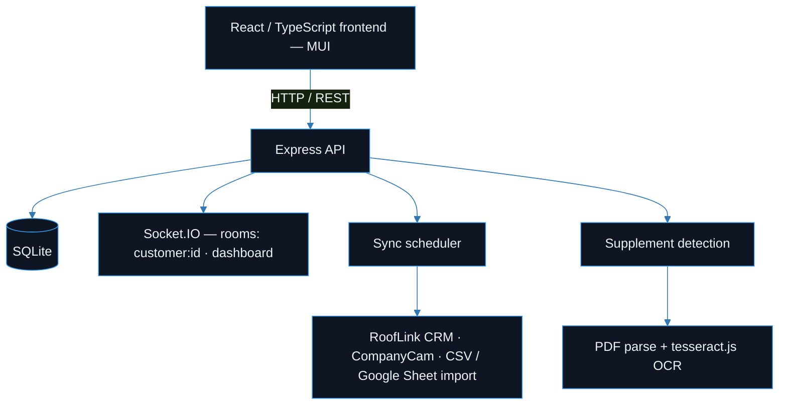

<div align="center">

# 📋 Claims Dashboard

**A roofing insurance-supplement management dashboard — Kanban workflow, install scheduling, photo tracking, and CRM sync in one place.**

[](#license)
[](#start)
[](#stack)
[](#stack)
[](#start)

**[Features](#features)** · **[Tech Stack](#stack)** · **[Architecture](#architecture)** · **[Getting Started](#start)** · **[Notes](#notes)**

</div>

---

Roofing contractors live and die by insurance supplements: the extra scope items an adjuster approves after the first estimate. Tracking dozens of jobs across "submitted / pending / approved / installed" by hand is where money leaks. Claims Dashboard pulls jobs, photos, and install dates together, moves them through a drag-and-drop Kanban pipeline, and keeps a live activity feed so nothing stalls.

> [!NOTE]
> This is a **genericized demo** of an internal tool I built for a roofing company. Real customer records, photos, and API keys have been replaced with sample data. It runs against the [RoofLink](https://rooflink.com) CRM and [CompanyCam](https://companycam.com) APIs when you supply your own credentials, and ships with sample data so the UI is populated out of the box.

<a name="features"></a>

## ✨ Features

- **Supplement Kanban board** — drag jobs between workflow stages (`@dnd-kit`), with per-stage totals and status chips.
- **Customer dashboard** — searchable/filterable grid of jobs with financial metrics (supplement value, approval rate) charted via Recharts.
- **Customer detail view** — profile, insurance panel, activity timeline, document folder browser, and an email-tracking panel for adjuster correspondence.
- **Install calendar** — FullCalendar view of scheduled installs, sourced from parsed install-date data.
- **Photo gallery** — per-customer job photos with thumbnails; adapters pull from RoofLink and CompanyCam (demo ships with placeholder images).
- **Automated supplement detection** — a background service scans job documents (PDF parsing + `tesseract.js` OCR) and auto-suggests supplement line items on a schedule.
- **RoofLink CRM sync** — a sync scheduler imports leads, jobs, and photos; supports CSV/Google Sheet imports as fallback data sources.
- **Real-time channel** — a Socket.IO server broadcasts `customer:updated`, `activity:new`, and hot-job alerts over customer- and dashboard-scoped rooms. The bundled `static_dashboard.html` demo auto-refreshes on an interval.
- **Hardened API** — JWT auth (Passport), Helmet, CORS, request validation, rate limiting, gzip compression, and a Swagger reference.

<a name="stack"></a>

## 🧰 Tech Stack

| Layer | Choice |
| :--- | :--- |
| **Backend** | Node.js, Express 5, Socket.IO, SQLite (`better-sqlite3` / `sqlite3`), Passport + JWT, `tesseract.js` (OCR), `sharp`, `papaparse` / `csv-parser`, `googleapis`, Helmet, express-validator |
| **Frontend** | React + TypeScript, Material-UI (MUI), `@dnd-kit` (drag-and-drop), FullCalendar, Recharts, React Router, Axios |
| **Infrastructure** | Docker Compose (backend + frontend + Redis), Nginx (frontend static serving / reverse proxy), GitHub Actions CI |

<a name="architecture"></a>

## 🏗️ Architecture



- `backend/routes/*` — thin HTTP handlers (customers, kanban, calendar, analytics, financials, photos, sync, detection, auth, health).
- `backend/services/*` — business logic: CRM adapters (`rooflinkService`, `roofLinkSyncService`, `companycamService`), `websocketService` (broadcast helpers + rooms), `supplementDetectionService`, `syncScheduler`, photo/OCR/PDF extractors.
- `backend/middleware/*` — JWT auth, validation, rate limiting, error handling.
- `database/schema.sql` — customers, jobs, supplements, activities, install dates.

<a name="start"></a>

## 🚀 Getting Started

Requires Node.js 18+ (20 recommended).

```bash
# 1. Backend
cd backend
cp .env.example .env        # fill in RoofLink / CompanyCam keys (optional — sample data works without them)
npm install
npm run dev                 # http://localhost:5000

# 2. Frontend (separate terminal)
cd frontend
cp .env.example .env
npm install
npm start                   # http://localhost:3000
```

The app boots with bundled sample data (`backend/public/data/*.json`), so the dashboard, calendar, and Kanban are populated immediately. Add real API keys to `.env` to enable live CRM sync.

<details>
<summary><b>🐳 Docker & zero-build demo</b></summary>
<br>

**Docker:**

```bash
docker compose up --build   # backend :5001, frontend :3001, redis :6379
```

**Zero-build demo:** open `static_dashboard.html` (or serve it) for a dependency-free view that reads the sample JSON and auto-refreshes — handy for a quick look without the React toolchain.

</details>

## 📸 Screenshots

_Add screenshots to `docs/` and reference them here._

## 🌐 Live Demo

_Live demo: coming soon._

<a name="notes"></a>

## 📝 Notes

Working prototype extracted from a real internal tool.

- [x] The React client consumes the REST API
- [x] The Socket.IO real-time channel is implemented server-side (rooms + broadcast helpers)
- [ ] Wire the real-time channel into the React UI

RoofLink and CompanyCam integrations require your own API credentials — see `backend/.env.example`.

<a name="license"></a>

## 📄 License

MIT © 2026 Jalen Ward
